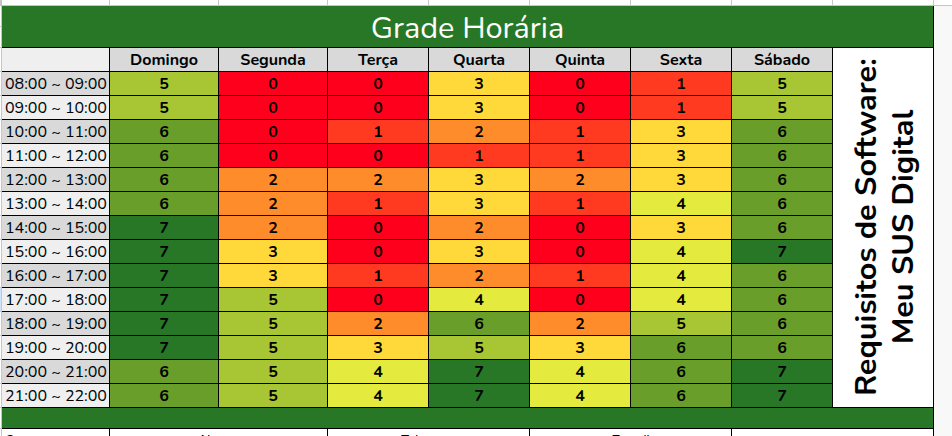

# Heatmap

## Introdução

Para definir os horários das reuniões semanais, foi utilizado um *heatmap* que mostra a disponibilidade de cada membro do grupo semanalmente. O objetivo é encontrar os melhores horários para as reuniões, levando em consideração a disponibilidade de todos os membros. As cores do *heatmap* indicam a disponibilidade de cada membro em cada horário e dia da semana, onde o verde representa disponibilidade alta, o amarelo representa disponibilidade média e o vermelho representa baixa disponibilidade.

---

## Integrantes do grupo envolvidos

A seguir apresentamos os nomes de cada integrante do grupo que participou nesse artefato e suas respectivas contribuições.

Tabela 1: Participantes envolvidos no artefato.

| Nome                                                   | O que fez                 |
| ------------------------------------------------------ | ---------------------- |
| [Arthur Evangelista de Oliveira](https://github.com/arthurevg), [Artur de Camargos Rodrigues](https://github.com/ArturDCR), [Davi Camilo Menezes](https://github.com/Davicamilo23), [Euller Júlio da Silva](https://github.com/Potatoyz908), [Gabriel Henrique Castelo Costa](https://github.com/GabrielCastelo-31), [Pedro Everton de Paula](https://github.com/pedroeverton217) e [Tiago Antunes Balieiro](https://github.com/tiagobalieiro) | Participaram da seleção de dias e horários disponíveis para reuniões ao decorrer da disciplina. |
|[Davi Camilo Menezes](https://github.com/Davicamilo23)| Adicionou a tabela de contribuição dos membros, revisou o artefato para a entrega final e fez as alterações necessárias. |

Autor: [Davi Camilo](https://github.com/Davicamilo23), 2025.

---

## Resultados

Figura 1: *Heatmap*

 
Fonte: Autores, 2025.

---

## Histórico de Versão

| Versão | Data          | Descrição                          | Autor(es)     |  Revisor(es)  |
| ------ | ------------- | ---------------------------------- | ------------- | ------------- |
| `1.0`  |  16/04/2025 |  Criação da página e adição do heatmap | [Gabriel Castelo](https://github.com/GabrielCastelo-31)  | [Artur de Camargos](https://github.com/ArturDCR) |
| `1.01` |  06/07/2025 | Pequenos ajustes de formatação | [Davi Camilo](https://github.com/Davicamilo23) | [Artur de Camargos](https://github.com/ArturDCR) |
| `1.1`  | 07/07/2025 | Adição da tabela de contribuição | [Davi Camilo](https://github.com/Davicamilo23) | [Artur de Camargos](https://github.com/ArturDCR)  |
