# Rich Picture

## Introdução
O *Rich Picture* é uma ferramenta visual usada para compreender e representar contextos de trabalho complexos, especialmente no início do design de sistemas. Por meio de desenhos informais e simbólicos, ele retrata os envolvidos no processo (*stakeholders*), suas preocupações, estruturas organizacionais e os fluxos de trabalho, permitindo uma visão ampla e integrada do ambiente. Seu objetivo é facilitar o entendimento de diferentes pontos de vista, promovendo decisões de projeto mais alinhadas com a realidade e as necessidades dos usuários.

---

Tabela 1: Cronograma do Storytelling.

| Nome                                                   | Data | Função            | 
| ------------------------------------------------------ | ---- | ----------------- |
| [Arthur Evangelista de Oliveira](https://github.com/arthurevg1) | 01/07/2025 | Analista de requisitos |
| [Artur de Camargos Rodrigues](https://github.com/ArturDCR) | 01/07/2025 | Analista de requisitos |
| [Davi Camilo Menezes](https://github.com/Davicamilo23) | 01/07/2025 | Analista de requisitos |
|  [Euller Júlio da Silva](https://github.com/Potatoyz908) | 01/07/2025 | Analista de requisitos |
| [Gabriel Henrique Castelo Costa](https://github.com/GabrielCastelo-31) | 01/07/2025 | Analista de requisitos |
| [Pedro Everton de Paula](https://github.com/pedroeverton217) | 01/07/2025 | Analista de requisitos |
| [Tiago Antunes Balieiro](https://github.com/tiagobalieiro) | 01/07/2025 | Analista de requisitos |
| João Igor | 01/07/2025 | Usuário do aplicativo | 

## Validação do Rich Picture com o Usuário

O vídeo abaixo contém a validação do artefato do grupo. A gravação foi feita de forma presencial na Faculdade de Ciência e Tecnologia em Engenharias(FCTE).

<iframe width="560" height="315" src="https://www.youtube.com/embed/8d_7kiy4Km4?si=87f1KvItbA3SGnn4" title="YouTube video player" frameborder="0" allow="accelerometer; autoplay; clipboard-write; encrypted-media; gyroscope; picture-in-picture; web-share" referrerpolicy="strict-origin-when-cross-origin" allowfullscreen></iframe>

---

## Rich Picture Escolhido
### Cinemark

Figura 1: *Rich Picture* versão 1.1.

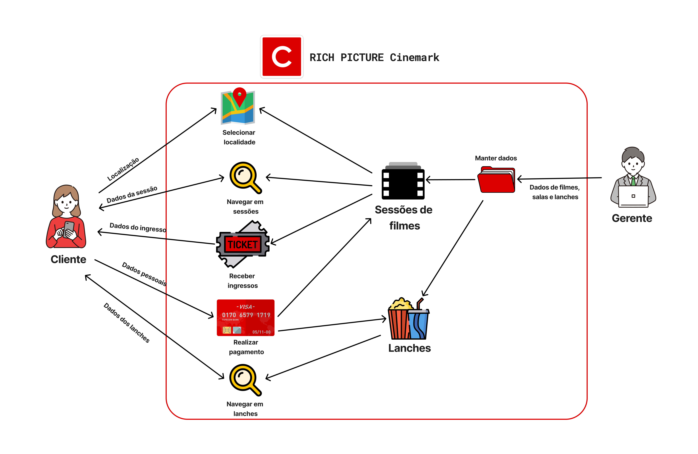

Fonte: [Gabriel Castelo](https://github.com/GabrielCastelo-31), 2025.

Figura 2: Legenda do *Rich Picture* versão 1.1.

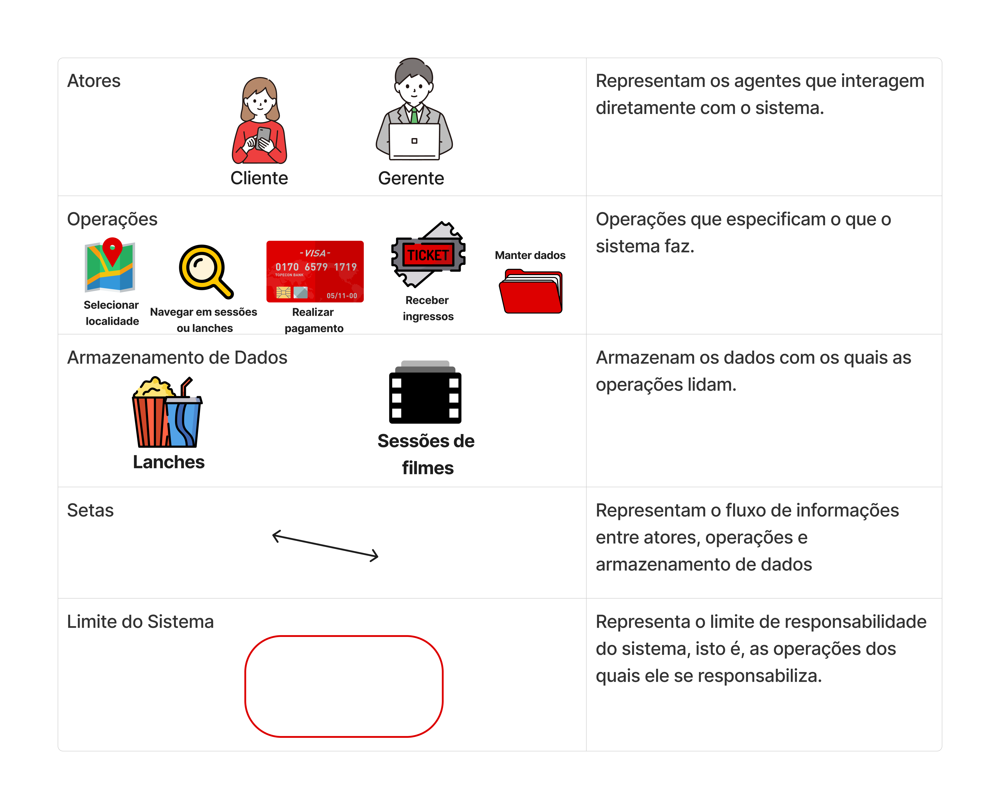

Fonte: [Gabriel Castelo](https://github.com/GabrielCastelo-31), 2025.

---

## Rich Pictures Avaliados
### IBGE

Figura 3: *Rich Picture* versão 1.1.

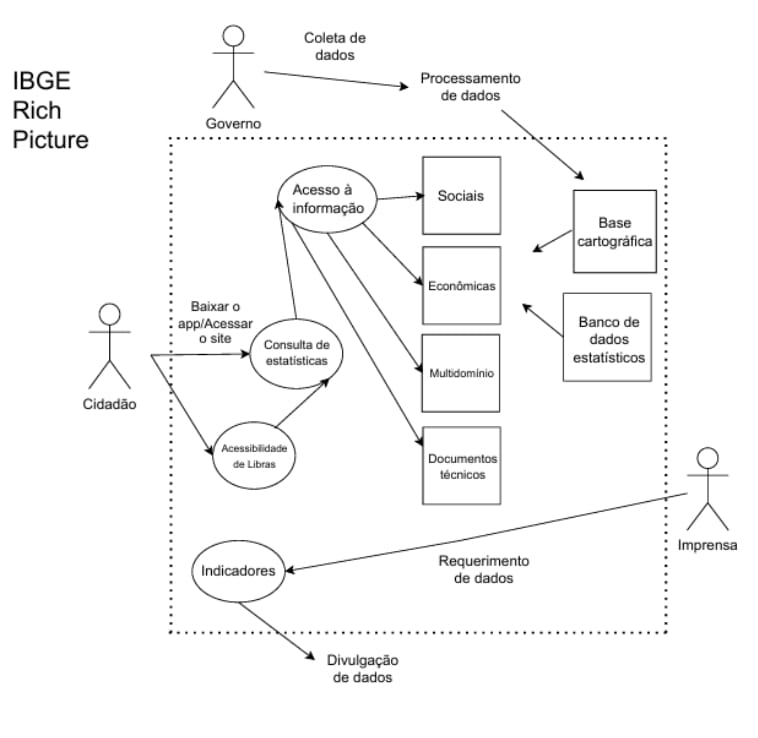

Fonte: [Davi Camilo](https://github.com/Davicamilo23), 2025.

Figura 4: Legenda do *Rich Picture* versão 1.1.

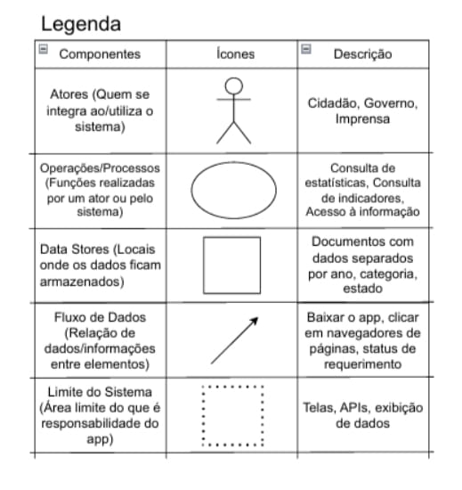

Fonte: [Davi Camilo](https://github.com/Davicamilo23), 2025.

### Celular Seguro BR

Figura 5: *Rich Picture* versão 1.1.

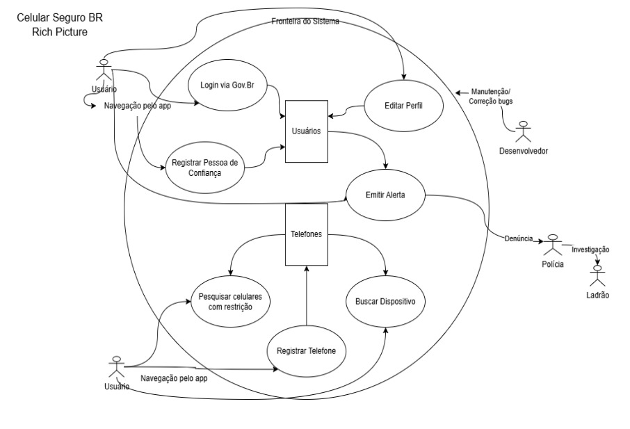

Fonte: [Tiago Antunes](https://github.com/TiagoBalieiro), 2025.

Figura 6: Legenda do *Rich Picture* versão 1.1.

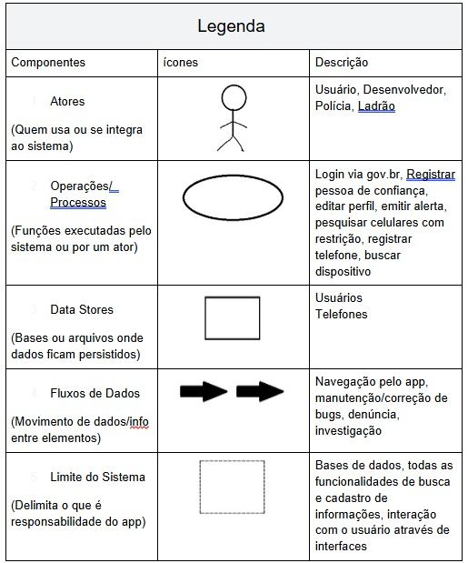

Fonte: [Tiago Antunes](https://github.com/TiagoBalieiro), 2025.

### Carteira Digital de Trânsito

Figura 7: *Rich Picture* versão 1.1.

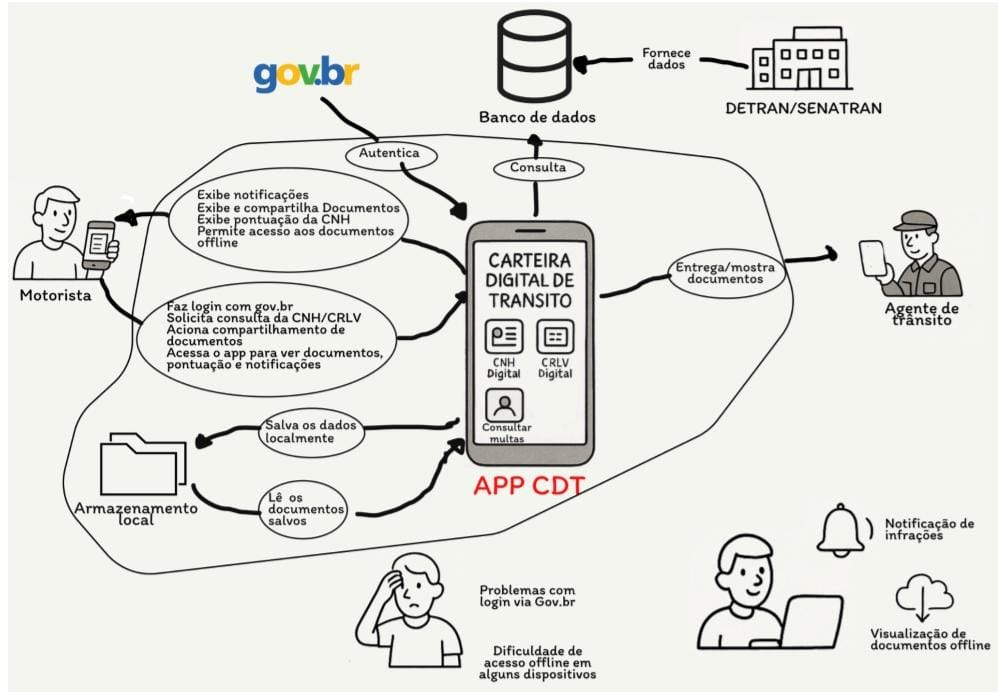

Fonte: [Arthur Evangelista](https://github.com/arthurevg), 2025.

Figura 8: Legenda do *Rich Picture* versão 1.1.

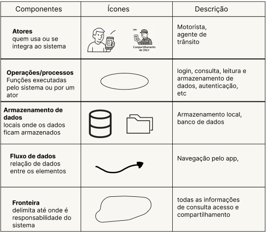

Fonte: [Arthur Evangelista](https://github.com/arthurevg), 2025.

### Meu SUS Digital

Figura 9: *Rich Picture* versão 1.1.

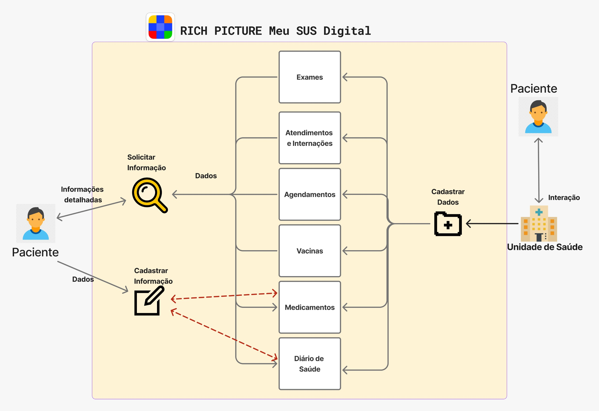

Fonte: [Gabriel Castelo](https://github.com/GabrielCastelo-31), 2025.

Figura 10: Legenda do *Rich Picture* versão 1.1.

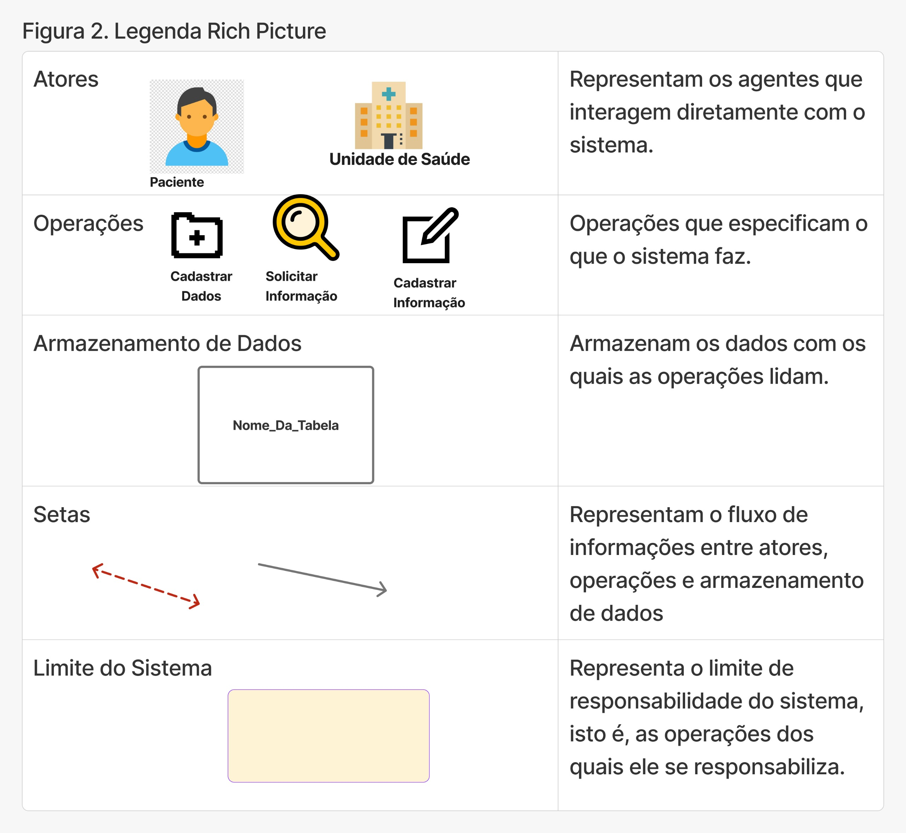

Fonte: [Gabriel Castelo](https://github.com/GabrielCastelo-31), 2025.

### Carteira de Trabalho Digital

Figura 11: *Rich Picture* versão 1.1.

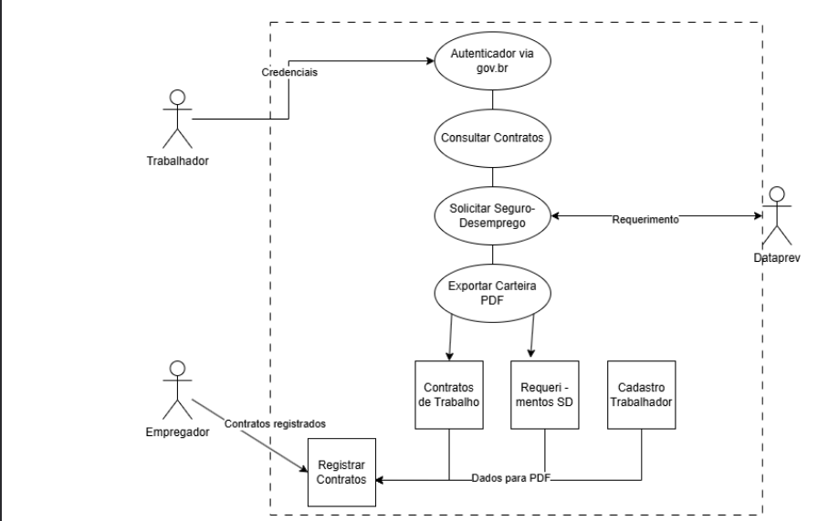

Fonte: [Euller Júlio](https://github.com/Potatoyz908), 2025.

Figura 12: Legenda do *Rich Picture* versão 1.1.

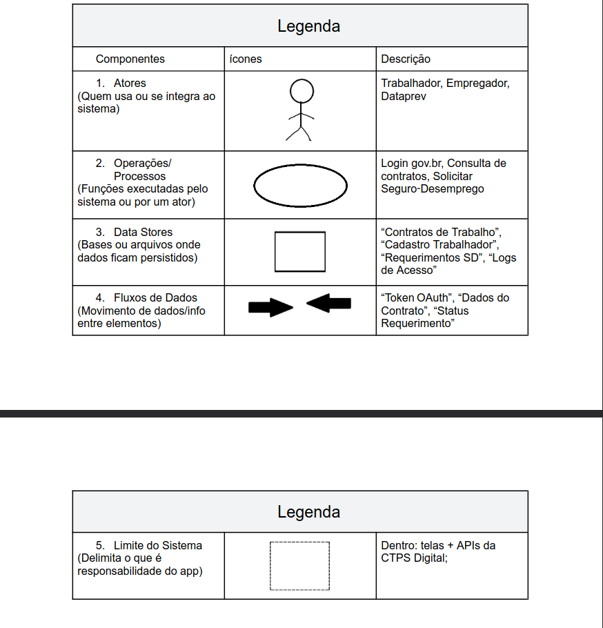

Fonte: [Euller Júlio](https://github.com/Potatoyz908), 2025.

---

## Referências Bibliográficas

> - [1] MONK, Andrew; HOWARD, Steve. The Rich Picture: A Tool for Reasoning About Work Context. Methods and tools, 1998.

---

## Histórico de Versão

| Versão | Data          | Descrição                          | Autor(es)     |  Revisor(es)  |
| ------ | ------------- | ---------------------------------- | ------------- | ------------- |
| `1.0`  |  13/04/2025 |  Criação do Documento | [Pedro Everton](https://github.com/pedroeverton217)  | [Gabriel Castelo](https://github.com/GabrielCastelo-31) e [Davi Camilo](https://github.com/Davicamilo23) |
| `1.1`  |  04/05/2025 |  Atualização do Documento | [Artur de Camargos](https://github.com/ArturDCR)  | [Davi Camilo](https://github.com/Davicamilo23) |
| `1.1.1`|  04/05/2025 | Ajuste nas fontes | [Davi Camilo](https://github.com/Davicamilo23) | [Artur de Camargos](https://github.com/ArturDCR)  |
| `1.2`|  04/07/2025 | Adição do vídeo e tabela de validação do Rich Picture | [Arthur Evangelista](https://github.com/arthurevg) | [Artur de Camargos](https://github.com/ArturDCR)  |
