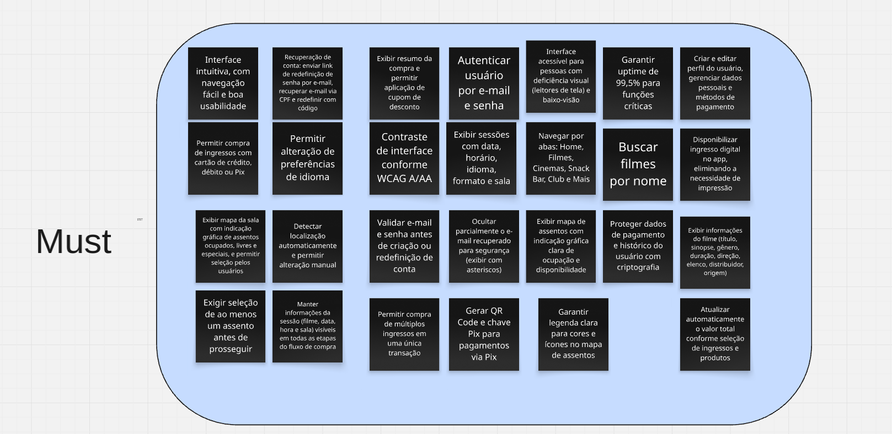
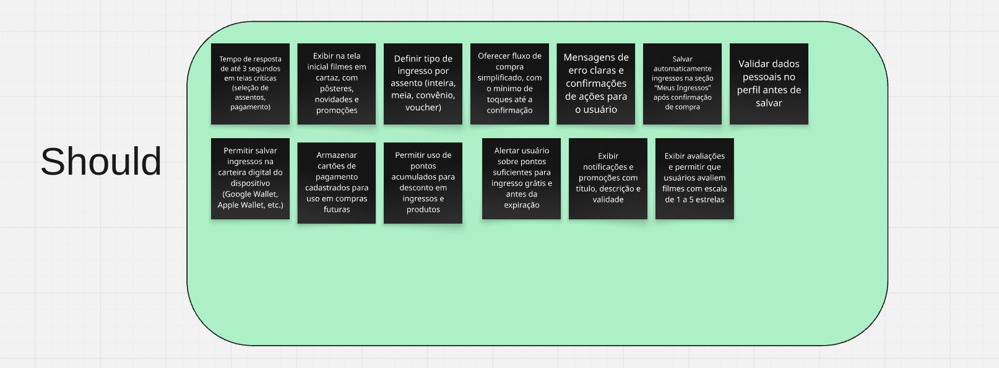
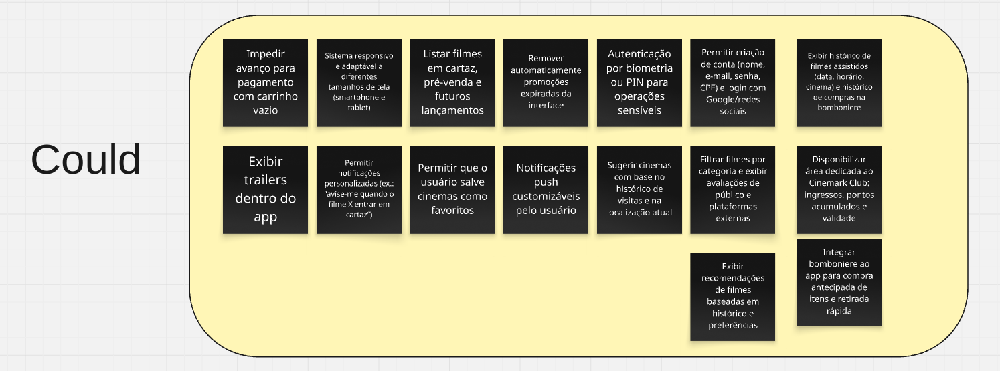
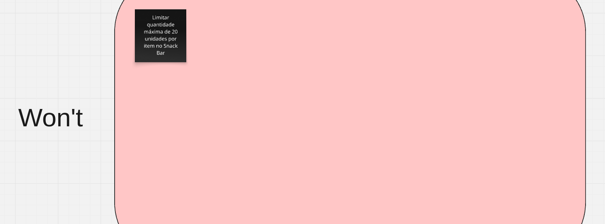

# MoSCoW

## Introdução

Este documento apresenta a priorização de requisitos para um sistema de venda de ingressos e gestão de cinemas, utilizando a técnica **MoSCoW**. Essa metodologia categoriza os requisitos em quatro grupos: **Must Have** (obrigatórios), **Should Have** (importantes), **Could Have** (desejáveis) e **Won't Have** (não prioritários). O objetivo é garantir o foco nas funcionalidades críticas para o sucesso do produto, alinhando-se às necessidades do usuário e às restrições técnicas.

---

## Metodologia

A priorização seguiu os critérios:

- **Must Have**: Requisitos essenciais para o funcionamento básico do sistema.

- **Should Have**: Funcionalidades importantes, mas que podem ser adiadas sem comprometer o lançamento.

- **Could Have**: Recursos desejáveis, porém não urgentes.

- **Won't Have**: Itens excluídos do escopo atual devido a baixo impacto ou complexidade.

Foi agendada uma reunião com a usuária, na qual a dinâmica da técnica foi explicada em detalhes. A partir disso, ela realizou a divisão dos requisitos entre as categorias estabelecidas.

---

## Cronograma

A tabela 1 apresenta o cronograma da priorização e as funções dos membros responsáveis pela técnica.

Tabela 1: Cronograma do MoSCoW.

| Nome                                                   | Data       | Função                 |
| ------------------------------------------------------ | ---------- | ---------------------- |
| [Artur de Camargos Rodrigues](https://github.com/ArturDCR) | 04/05/2025 | Mediador |
| [Davi Camilo Menezes](https://github.com/Davicamilo23) | 04/05/2025 | Mediador |
| [Gabriel Henrique Castelo Costa](https://github.com/GabrielCastelo-31) | 04/05/2025 | Mediador |
| Giovanna Aguiar | 04/05/2025 | Usuária do aplicativo |

Fonte: [Davi Camilo](https://github.com/Davicamilo23), 2025.

---

## Gravação com Usuária

<iframe width="560" height="315" src="https://www.youtube.com/embed/qba_o8SSdFc" title="YouTube video player" frameborder="0" allow="accelerometer; autoplay; clipboard-write; encrypted-media; gyroscope; picture-in-picture; web-share" referrerpolicy="strict-origin-when-cross-origin" allowfullscreen></iframe>

---

## Tabela 2 - Priorização dos Requisitos

| Classificação | ID    | Descrição                                                                                                                                                       | Rastreabilidade            |
|---------------|-------|-----------------------------------------------------------------------------------------------------------------------------------------------------------------|----------------------------|
| **Must Have** | | | |
|               | [RQ44](../elicitação/requisitosElicitados.md)  | Interface acessível para pessoas com deficiência visual (leitores de tela) e baixo-visão.                                                                      | [IS35](../elicitação/introspecção.md#IS35), [IS36](../elicitação/introspecção.md#IS36), [AI25](../elicitação/analiseUI.md#AI25), [ST05](../elicitação/storytelling.md#ST05)           |
|               | [RQ43](../elicitação/requisitosElicitados.md)  | Interface intuitiva, com navegação fácil e boa usabilidade.                                                                                                      | [IS28](../elicitação/introspecção.md#IS28)                       |
|               | [RQ16](../elicitação/requisitosElicitados.md)  | Exibir resumo da compra e permitir aplicação de cupom de desconto.                                                                                              | [AI13](../elicitação/analiseUI.md#AI13), [AI29](../elicitação/analiseUI.md#AI29)                 |
|               | [RQ04](../elicitação/requisitosElicitados.md)  | Autenticar usuário por e-mail e senha.                                                                                                                           | [AI04](../elicitação/analiseUI.md#AI04)                       |
|               | [RQ41](../elicitação/requisitosElicitados.md)  | Garantir uptime de 99,5% para funções críticas.                                                                                                                 | [AI28](../elicitação/analiseUI.md#AI28)                       |
|               | [RQ37](../elicitação/requisitosElicitados.md)  | Criar e editar perfil do usuário, gerenciar dados pessoais e métodos de pagamento.                                                                             | [AI31](../elicitação/analiseUI.md#AI31)                       |
|               | [RQ21](../elicitação/requisitosElicitados.md)  | Recuperação de conta: enviar link de redefinição de senha por e-mail, recuperar e-mail via CPF e redefinir com código.                                           | [AI18](../elicitação/analiseUI.md#AI18), [AI19](../elicitação/analiseUI.md#AI19), [AI20](../elicitação/analiseUI.md#AI20)           |
|               | [RQ09](../elicitação/requisitosElicitados.md)  | Permitir compra de ingressos com cartão de crédito, débito ou Pix.                                                                                             | [IS05](../elicitação/introspecção.md#IS05), [AI14](../elicitação/analiseUI.md#AI14), [Q02](../elicitação/questionario.md#Q02)            |
|               | [RQ33](../elicitação/requisitosElicitados.md)  | Permitir alteração de preferências de idioma.                                                                                                                   | [IS25](../elicitação/introspecção.md#IS25)                       |
|               | [RQ45](../elicitação/requisitosElicitados.md)  | Contraste de interface conforme WCAG A/AA.                                                                                                                     | [AI25](../elicitação/analiseUI.md#AI25)                       |
|               | [RQ08](../elicitação/requisitosElicitados.md)  | Exibir sessões com data, horário, idioma, formato e sala.                                                                                                      | [IS04](../elicitação/introspecção.md#IS04), [ST01](../elicitação/storytelling.md#ST01), [AI08](../elicitação/analiseUI.md#AI08), [Q01](../elicitação/questionario.md#Q01)      |
|               | [RQ03](../elicitação/requisitosElicitados.md)  | Navegar por abas: Home, Filmes, Cinemas, Snack Bar, Club e Mais.                                                                                                | [AI03](../elicitação/analiseUI.md#AI03)                       |
|               | [RQ05](../elicitação/requisitosElicitados.md)  | Buscar filmes por nome.                                                                                                                                         | [AI05](../elicitação/analiseUI.md#AI05)                       |
|               | [RQ18](../elicitação/requisitosElicitados.md)  | Disponibilizar ingresso digital no app, eliminando a necessidade de impressão.                                                                                 | [IS09](../elicitação/introspecção.md#IS09), [ST03](../elicitação/storytelling.md#ST03)                 |
|               | [RQ12](../elicitação/requisitosElicitados.md)  | Exibir mapa da sala com indicação gráfica de assentos ocupados, livres e especiais, e permitir seleção pelos usuários.                                         | [IS08](../elicitação/introspecção.md#IS08), [AI09](../elicitação/analiseUI.md#AI09)                 |
|               | [RQ02](../elicitação/requisitosElicitados.md)  | Detectar localização automaticamente e permitir alteração manual.                                                                                             | [IS02](../elicitação/introspecção.md#IS02), [AI02](../elicitação/analiseUI.md#AI02)                 |
|               | [RQ55](../elicitação/requisitosElicitados.md)  | Validar e-mail e senha antes de criação ou redefinição de conta.                                                                                                | [AI34](../elicitação/analiseUI.md#AI34)                       |
|               | [RQ54](../elicitação/requisitosElicitados.md)  | Ocultar parcialmente o e-mail recuperado para segurança (exibir com asteriscos).                                                                                | [AI33](../elicitação/analiseUI.md#AI33)                       |
|               | [RQ51](../elicitação/requisitosElicitados.md)  | Exibir mapa de assentos com indicação gráfica clara de ocupação e disponibilidade.                                                                             | [IS31](../elicitação/introspecção.md#IS31)                       |
|               | [RQ48](../elicitação/requisitosElicitados.md)  | Proteger dados de pagamento e histórico do usuário com criptografia.                                                                                          | [IS32](../elicitação/introspecção.md#IS32), [Q10](../elicitação/questionario.md#Q10)                  |
|               | [RQ07](../elicitação/requisitosElicitados.md)  | Exibir informações do filme (título, sinopse, gênero, duração, direção, elenco, distribuidor, origem).                                                         | [IS03](../elicitação/introspecção.md#IS03), [AI07](../elicitação/analiseUI.md#AI07)                 |
|               | [RQ53](../elicitação/requisitosElicitados.md)  | Manter informações da sessão (filme, data, hora e sala) visíveis em todas as etapas do fluxo de compra.                                                       | [AI27](../elicitação/analiseUI.md#AI27)                       |
|               | [RQ13](../elicitação/requisitosElicitados.md)  | Exigir seleção de ao menos um assento antes de prosseguir.                                                                                                    | [AI10](../elicitação/analiseUI.md#AI10)                       |
|               | [RQ11](../elicitação/requisitosElicitados.md)  | Permitir compra de múltiplos ingressos em uma única transação.                                                                                                 | [IS07](../elicitação/introspecção.md#IS07)                       |
|               | [RQ17](../elicitação/requisitosElicitados.md)  | Gerar QR Code e chave Pix para pagamentos via Pix.                                                                                                            | [AI15](../elicitação/analiseUI.md#AI15)                       |
|               | [RQ46](../elicitação/requisitosElicitados.md)  | Garantir legenda clara para cores e ícones no mapa de assentos.                                                                                                | [AI22](../elicitação/analiseUI.md#AI22)                       |
|               | [RQ47](../elicitação/requisitosElicitados.md)  | Atualizar automaticamente o valor total conforme seleção de ingressos e produtos.                                                                             | [AI23](../elicitação/analiseUI.md#AI23)                       |
| **Should Have** | | | |
|               | [RQ40](../elicitação/requisitosElicitados.md)  | Tempo de resposta de até 3 segundos em telas críticas (seleção de assentos, pagamento).                                                                       | [IS29](../elicitação/introspecção.md#IS29), [Q09](../elicitação/questionario.md#Q09), [Q12](../elicitação/questionario.md#Q12)             |
|               | [RQ01](../elicitação/requisitosElicitados.md)  | Exibir na tela inicial filmes em cartaz, com pôsteres, novidades e promoções.                                                                                 | [IS01](../elicitação/introspecção.md#IS01), [AI01](../elicitação/analiseUI.md#AI01)                 |
|               | [RQ14](../elicitação/requisitosElicitados.md)  | Definir tipo de ingresso por assento (inteira, meia, convênio, voucher).                                                                                      | [AI11](../elicitação/analiseUI.md#AI11)                       |
|               | [RQ25](../elicitação/requisitosElicitados.md)  | OO fluxo de compra de ingresso do aplicativo deve possuir no máximo 5 etapas.                                                                               | [IS17](../elicitação/introspecção.md#IS17)                       |
|               | [RQ38](../elicitação/requisitosElicitados.md)  | Mensagens de erro claras e confirmações de ações para o usuário.                                                                                              | [ST05](../elicitação/storytelling.md#ST05), [IS37](../elicitação/introspecção.md#IS37)                 |
|               | [RQ19](../elicitação/requisitosElicitados.md)  | Salvar automaticamente ingressos na seção “Meus Ingressos” após confirmação de compra.                                                                       | [AI16](../elicitação/analiseUI.md#AI16)                       |
|               | [RQ57](../elicitação/requisitosElicitados.md)  | Validar dados pessoais no perfil antes de salvar.                                                                                                             | [AI36](../elicitação/analiseUI.md#AI36)                       |
|               | [RQ26](../elicitação/requisitosElicitados.md)  | Permitir salvar ingressos na carteira digital do dispositivo (Google Wallet, Apple Wallet, etc).                                                             | [IS18](../elicitação/introspecção.md#IS18)                       |
|               | [RQ28](../elicitação/requisitosElicitados.md)  | Alertar usuário sobre pontos suficientes para ingresso grátis e antes da expiração.                                                                         | [IS20](../elicitação/introspecção.md#IS20)                       |
|               | [RQ39](../elicitação/requisitosElicitados.md)  | Exibir avaliações e permitir que usuários avaliem filmes com escala de 1 a 5 estrelas.                                                                        | [IS15](../elicitação/introspecção.md#IS15)                       |
|               | [RQ35](../elicitação/requisitosElicitados.md)  | Exibir notificações e promoções com título, descrição e validade.                                                                                           | [AI32](../elicitação/analiseUI.md#AI32)                       |
|               | [RQ10](../elicitação/requisitosElicitados.md)  | Armazenar cartões de pagamento cadastrados para uso em compras futuras.                                                                                       | [IS06](../elicitação/introspecção.md#IS06)                       |
|               | [RQ27](../elicitação/requisitosElicitados.md)  | Permitir uso de pontos acumulados para desconto em ingressos e produtos.                                                                                     | [IS19](../elicitação/introspecção.md#IS19), [Q03](../elicitação/questionario.md#Q03)                  |
| **Could Have** | | | |
|               | [RQ36](../elicitação/requisitosElicitados.md)  | Impedir avanço para pagamento com carrinho vazio.                                                                                                            | [AI30](../elicitação/analiseUI.md#AI30)                       |
|               | [RQ42](../elicitação/requisitosElicitados.md)  | Sistema responsivo e adaptável a diferentes tamanhos de tela (smartphone e tablet).                                                                          | [AI24](../elicitação/analiseUI.md#AI24)                       |
|               | [RQ06](../elicitação/requisitosElicitados.md)  | Listar filmes em cartaz, pré-venda e futuros lançamentos.                                                                                                    | [AI06](../elicitação/analiseUI.md#AI06)                       |
|               | [RQ56](../elicitação/requisitosElicitados.md)  | Remover automaticamente promoções expiradas da interface.                                                                                                    | [AI35](../elicitação/analiseUI.md#AI35)                       |
|               | [RQ49](../elicitação/requisitosElicitados.md)  | Autenticação por biometria ou PIN para operações sensíveis.                                                                                                  | [IS33](../elicitação/introspecção.md#IS33)                       |
|               | [RQ20](../elicitação/requisitosElicitados.md)  | Permitir criação de conta (nome, e-mail, senha, CPF) e login com Google/redes sociais.                                                                        | [AI17](../elicitação/analiseUI.md#AI17), [IS26](../elicitação/introspecção.md#IS26)                 |
|               | [RQ22](../elicitação/requisitosElicitados.md)  | Exibir histórico de filmes assistidos (data, horário, cinema) e histórico de compras na bomboniere.                                                           | [IS13](../elicitação/introspecção.md#IS13), [IS14](../elicitação/introspecção.md#IS14)                 |
|               | [RQ24](../elicitação/requisitosElicitados.md)  | Exibir trailers dentro do app.                                                                                                                                  | [IS16](../elicitação/introspecção.md#IS16)                       |
|               | [RQ29](../elicitação/requisitosElicitados.md)  | Sugerir cinemas com base no histórico de visitas e na localização atual.                                                                                      | [IS21](../elicitação/introspecção.md#IS21)                       |
|               | [RQ23](../elicitação/requisitosElicitados.md)  | Filtrar filmes por categoria e exibir avaliações de público e plataformas externas.                                                                           | [IS15](../elicitação/introspecção.md#IS15)                       |
|               | [RQ31](../elicitação/requisitosElicitados.md)  | Permitir notificações personalizadas (ex.: “avise-me quando o filme X entrar em cartaz”).                                                                    | [IS23](../elicitação/introspecção.md#IS23)                       |
|               | [RQ30](../elicitação/requisitosElicitados.md)  | Permitir que o usuário salve cinemas como favoritos.                                                                                                         | [IS22](../elicitação/introspecção.md#IS22)                       |
|               | [RQ50](../elicitação/requisitosElicitados.md)  | Notificações push customizáveis pelo usuário.                                                                                                                | [IS34](../elicitação/introspecção.md#IS34)                       |
|               | [RQ34](../elicitação/requisitosElicitados.md)  | Disponibilizar área dedicada ao Cinemark Club: ingressos, pontos acumulados e validade.                                                                      | [IS12](../elicitação/introspecção.md#IS12)                       |
|               | [RQ15](../elicitação/requisitosElicitados.md)  | Integrar bomboniere ao app para compra antecipada de itens e retirada rápida.                                                                                | [IS11](../elicitação/introspecção.md#IS11), [AI12](../elicitação/analiseUI.md#AI12)                 |
|               | [RQ32](../elicitação/requisitosElicitados.md)  | Exibir recomendações de filmes baseadas em histórico e preferências.                                                                                         | [IS24](../elicitação/introspecção.md#IS24)                       |
| **Won't Have** | | | |
|               | [RQ52](../elicitação/requisitosElicitados.md)  | Limitar quantidade máxima de 20 unidades por item no Snack Bar.                                                                                              | [AI26](../elicitação/analiseUI.md#AI26)                       |

  

  
  

---

## Conclusão

A técnica de priorização MoSCoW foi aplicada com sucesso para orientar a definição de prioridades dos [Requisitos elicitados](https://requisitos-de-software.github.io/2025.1-Cinemark/elicita%C3%A7%C3%A3o/requisitosElicitados/). Por meio da categorização em Must Have, Should Have, Could Have e Won’t Have, foi possível alinhar as funcionalidades às necessidades da usuária e às restrições do projeto, garantindo foco nos elementos essenciais para o funcionamento do sistema. A priorização foi realizada em conjunto com a usuária final, garantindo representatividade da perspectiva do usuário.

---

## Referência Bibliográfica

> Interaction Design Foundation - IxDF. (2015, November 18). Making Your UX Life Easier with the MoSCoW. Interaction Design Foundation - IxDF. Disponível em: <https://www.interaction-design.org/literature/article/making-your-ux-life-easier-with-the-moscow>. Acesso em: 04 maio 2025.

---

## Histórico de Versão

| Versão | Data       | Descrição                          | Autor(es)     | Revisor(es) |
|--------|------------|------------------------------------|---------------|-------------|
| `1.0`  | 04/05/2025 | Criação do Documento | [Davi Camilo](https://github.com/Davicamilo23) | Todos |
| `1.1`  | 04/05/2025 | Incluindo dados da reunião | [Artur de Camargos](https://github.com/ArturDCR) | [Davi Camilo](https://github.com/Davicamilo23) |
| `1.2`  | 04/05/2025 | Atualização do link da reunião com o suário | [Artur de Camargos](https://github.com/ArturDCR) | [Davi Camilo](https://github.com/Davicamilo23) |
| `1.3`  | 04/05/2025 | Inclusão da bibliografia | [Artur de Camargos](https://github.com/ArturDCR) | [Davi Camilo](https://github.com/Davicamilo23) |
| `1.4`  | 09/05/2025 | Inclusão da tabela de requisitos | [Artur de Camargos](https://github.com/ArturDCR) | [Davi Camilo](https://github.com/Davicamilo23) |
| `1.5`  | 13/05/2025 | Adição do cronograma da técnica, ajuste na tabela 2 e ajuste na metodologia | [Davi Camilo](https://github.com/Davicamilo23) | [Pedro Everton](https://github.com/pedroeverton217) |
| `1.6`  | 06/07/2025 | Adição de Conclusão e pequenas correções da lista de inspeção |[Tiago Antunes Balieiro](https://github.com/tiagobalieiro)  | [Gabriel Castelo](https://github.com/GabrielCastelo-31)|