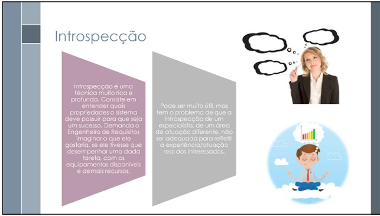

# Verificação do grupo+1

## Introdução

Este documento apresenta a **lista de verificação** (versão 2.0) elaborada para avaliar os artefatos produzidos na Entrega 2: *Elicitação: Usuários, Técnicas de Elicitação e Técnicas de Priorização*. As tabelas foram elaboradas seguindo o modelo de lista de verificação sugerida pelo professor, [André Barros de Sales](https://sigaa.unb.br/sigaa/public/docente/portal.jsf?siape=1314342), sendo uma lista que será usada na inspeção da entrega 1, tanto para o grupo, quanto para o grupo+1.

---

## Lista de Verificação (Versão 2.0)

### Tabela 1: Lista de Verificação — Perfil de Usuário

| Item                                                                                                                                       | Autor   | Referência                                                                                                                                               |
| ------------------------------------------------------------------------------------------------------------------------------------------ | ------- | -------------------------------------------------------------------------------------------------------------------------------------------------------- |
| **1.** Foi realizada a especificação de requisitos de maneira a compreender as ideias dos stakeholders corretamente?                              | [Davi Camilo](https://github.com/Davicamilo23) | SOMMERVILLE, Ian. *Engenharia de Software.* 9. ed. São Paulo: Pearson Addison Wesley, 2011. Cap. 4.3, p. 65  |
| **2.** Os requisitos funcionais ou não funcionais foram bem descritos e distinguidos?                                                             | [Davi Camilo](https://github.com/Davicamilo23) | SOMMERVILLE, Ian. *Engenharia de Software.* 9. ed. São Paulo: Pearson Addison Wesley, 2011. Cap. 4.3, p. 65  |
| **3.** Os requisitos de usuário foram escritos em linguagem natural, com tabelas simples, formas e diagramas intuitivos?                          | [Davi Camilo](https://github.com/Davicamilo23) |  SOMMERVILLE, Ian. *Engenharia de Software.* 9. ed. São Paulo: Pearson Addison Wesley, 2011. Cap. 4.3, p. 65  |
| **4.** Foi realizada a elicitação e análise de requisitos?                                                                                        | [Davi Camilo](https://github.com/Davicamilo23) | SOMMERVILLE, Ian. *Engenharia de Software.* 9. ed. São Paulo: Pearson Addison Wesley, 2011. Cap. 4.5, p. 69  |
| **5.** Os perfis de usuários foram identificados com clareza?                                                                                     | [Davi Camilo](https://github.com/Davicamilo23) | REINEHR, Sheila. *Engenharia de Requisitos.* Grupo A, Selo Sagah, 1ª ed. 2020. p. 54  |
| **6.** Foi criada uma lista com todos os stakeholders?                                                                                            | [Davi Camilo](https://github.com/Davicamilo23) | REINEHR, Sheila. *Engenharia de Requisitos.* Grupo A, Selo Sagah, 1ª ed. 2020. p. 56  |
| **7.** O perfil foi validado com dados reais, como entrevistas ou observações?                                                                    | [Davi Camilo](https://github.com/Davicamilo23) | REINEHR, Sheila. *Engenharia de Requisitos.* Grupo A, Selo Sagah, 1ª ed. 2020. p. 75  |
| **8.** Foi realizado um diagrama de casos de uso, ou outras ferramentas como user story mapping, para auxiliar no entendimento do perfil do usuário? | [Davi Camilo](https://github.com/Davicamilo23) |  REINEHR, Sheila. *Engenharia de Requisitos.* Grupo A, Selo Sagah, 1ª ed. 2020. p. 118  |

Autor: [Davi Camilo](https://github.com/Davicamilo23), 2025.

---

### Tabela 2: Lista de Verificação — Personas

| Item | Autor | Referência |
| ---- | ----- | ---------- |
| **1.** O mapeamento de personas, ou seja, caracterizar um representante hipotético, genérico, de uma classe de usuários, foi feito corretamente? | [Davi Camilo](https://github.com/Davicamilo23) | REINEHR, Sheila. *Engenharia de Requisitos.* Grupo A, Selo Sagah, 1ª ed. 2020. Cap. Seleção de técnicas de elicitação de requisitos de software, p. 57.  |
| **2.** Foram diferenciadas as personas primárias das secundárias, e vice-versa? | [Davi Camilo](https://github.com/Davicamilo23) | REINEHR, Sheila. *Engenharia de Requisitos.* Grupo A, Selo Sagah, 1ª ed. 2020. Cap. Seleção de técnicas de elicitação de requisitos de software, p. 57.  |
| **3.** As personas foram caracterizadas considerando características e comportamentos sociais e demográficos, preferências, preocupações e informações similares? | [Davi Camilo](https://github.com/Davicamilo23) | REINEHR, Sheila. *Engenharia de Requisitos.* Grupo A, Selo Sagah, 1ª ed. 2020. Cap. Seleção de técnicas de elicitação de requisitos de software, p. 57.  |
| **4.** Diferentes perfis foram analisados para ajudar na identificação dos requisitos? | [Davi Camilo](https://github.com/Davicamilo23) | REINEHR, Sheila. *Engenharia de Requisitos.* Grupo A, Selo Sagah, 1ª ed. 2020. Cap. Aplicação do diagrama de casos de uso, p. 130.  |
| **5.** A identificação de quais stakeholders devem fazer a validação foi feita da maneira certa (a partir das personas)? | [Davi Camilo](https://github.com/Davicamilo23) | REINEHR, Sheila. *Engenharia de Requisitos.* Grupo A, Selo Sagah, 1ª ed. 2020. Cap. Validação de requisitos de software, p. 251.  |
| **6**. A persona foi baseada em dados reais coletados por técnicas como entrevistas, questionários ou observações? | [Davi Camilo](https://github.com/Davicamilo23) | REINEHR, Sheila. *Engenharia de Requisitos.* Grupo A, Selo Sagah, 1ª ed. 2020. Cap. Aplicação de técnicas de elicitação de requisitos de software, p. 75.  |
| **7.** A persona apresenta objetivos e motivações claras relacionadas ao uso do sistema, baseando-se na especificação de requisitos? | [Davi Camilo](https://github.com/Davicamilo23) | SOMMERVILLE, Ian. *Engenharia de Software.* 9. ed. São Paulo: Pearson Addison Wesley, 2011. Cap. 4.3, p. 65.  |
| **8.** O sistema está pronto para a criação de novas personas para caso mudanças aconteçam com os stakeholders? | [Davi Camilo](https://github.com/Davicamilo23) | LEFFINGWELL, D.; WIDRIG, D. *Managing Software Requirements: A Use Case Approach.* 2ª ed. Addison-Wesley, 2003. Cap. 34.  |

Autor: [Davi Camilo](https://github.com/Davicamilo23), 2025.

---

### Tabela 3: Lista de Verificação — Técnica de Elicitação Análise de Interface de Usuário

| Item | Autor | Referência |
|------|-------|------------|
| **1.** Foram identificados os componentes visuais e funcionais presentes nas interfaces do sistema examinado? | [Euller Júlio](https://github.com/Potatoyz908) | WIEGERS, Karl E.; BEATTY, Joy. *Software Requirements.* 3. ed. Redmond: Microsoft Press, 2013. |
| **2.** A navegação entre as diferentes telas foi analisada para compreender os fluxos de uso e a experiência do usuário? | [Euller Júlio](https://github.com/Potatoyz908) | WIEGERS, Karl E.; BEATTY, Joy. *Software Requirements.* 3. ed. Redmond: Microsoft Press, 2013. |
| **3.** Durante a análise, foi considerado de que forma os usuários interagem com elementos como botões, menus e campos? | [Euller Júlio](https://github.com/Potatoyz908) | WIEGERS, Karl E.; BEATTY, Joy. *Software Requirements.* 3. ed. Redmond: Microsoft Press, 2013. |
| **4.** As telas consideradas críticas (como autenticação, finalização de compra e pagamentos) foram verificadas quanto à clareza e acessibilidade das funções? | [Euller Júlio](https://github.com/Potatoyz908) | WIEGERS, Karl E.; BEATTY, Joy. *Software Requirements.* 3. ed. Redmond: Microsoft Press, 2013. |
| **5.** A acessibilidade da interface foi avaliada, incluindo aspectos como contraste, leitura e usabilidade em dispositivos móveis? | [Euller Júlio](https://github.com/Potatoyz908) | WIEGERS, Karl E.; BEATTY, Joy. *Software Requirements.* 3. ed. Redmond: Microsoft Press, 2013. |
| **6.** Foram identificados requisitos não funcionais a partir da análise das interações realizadas no sistema? | [Euller Júlio](https://github.com/Potatoyz908) | WIEGERS, Karl E.; BEATTY, Joy. *Software Requirements.* 3. ed. Redmond: Microsoft Press, 2013. |
| **7.** Os requisitos funcionais foram derivados com base nas interações observadas no sistema estudado? | [Euller Júlio](https://github.com/Potatoyz908) | WIEGERS, Karl E.; BEATTY, Joy. *Software Requirements.* 3. ed. Redmond: Microsoft Press, 2013. |
| **8.** Inconsistências ou possíveis melhorias nos caminhos de navegação e interação foram detectadas durante a análise? | [Euller Júlio](https://github.com/Potatoyz908) | WIEGERS, Karl E.; BEATTY, Joy. *Software Requirements.* 3. ed. Redmond: Microsoft Press, 2013. |

Autor: [Euller Júlio](https://github.com/Potatoyz908), 2025.

---

### Tabela 4: Lista de Verificação — Técnica de Elicitação Introspecção

| Item | Autor | Referência |
|------|-------|------------|
| **1.** O grupo demonstrou ter se colocado no lugar do usuário ao definir os requisitos? | [Arthur Evangelista](https://github.com/arthurevg) | SERRANO, Milene; SERRANO, Maurício. *Engenharia de Requisitos – Aula 07: Técnicas de Elicitação.* Gama, DF: UnB/FGA, 2024. Material de aula. Disponível em: <https://aprender3.unb.br/course/view.php?id=24696&section=6>. Acesso em: 9 maio 2025.  |
| **2.** Foram considerados os recursos e equipamentos reais disponíveis para a tarefa? | [Arthur Evangelista](https://github.com/arthurevg) | SERRANO, Milene; SERRANO, Maurício. *Engenharia de Requisitos – Aula 07: Técnicas de Elicitação.* Gama, DF: UnB/FGA, 2024. Material de aula. Disponível em: <https://aprender3.unb.br/course/view.php?id=24696&section=6>. Acesso em: 9 maio 2025.  |
| **3.** As propriedades do sistema foram definidas com base nessa simulação de uso? | [Arthur Evangelista](https://github.com/arthurevg) | SERRANO, Milene; SERRANO, Maurício. *Engenharia de Requisitos – Aula 07: Técnicas de Elicitação.* Gama, DF: UnB/FGA, 2024. Material de aula. Disponível em: <https://aprender3.unb.br/course/view.php?id=24696&section=6>. Acesso em: 9 maio 2025.  |

Autor: [Arthur Evangelista](https://github.com/arthurevg), 2025.

---

### Tabela 5: Lista de Verificação — Técnica de Elicitação Questionário

| Item                                                                                                                             | Autor                                             | Referência                                                                                                    |
| -------------------------------------------------------------------------------------------------------------------------------- | ------------------------------------------------- | ------------------------------------------------------------------------------------------------------------- |
| **1.** O questionário foi formulado com perguntas claras e objetivas, visando obter informações diretas dos stakeholders?        | [Tiago Antunes](https://github.com/tiagobalieiro) | WIEGERS, Karl; BEATTY, Joy. *Software Requirements*. 3. ed. Redmond: Microsoft Press, 2013.                   |
| **2.** Foram consideradas diferentes perspectivas dos stakeholders ao formular as perguntas?                                     | [Tiago Antunes](https://github.com/tiagobalieiro) | SOMMERVILLE, Ian. *Engenharia de Software*. 9. ed. São Paulo: Pearson, 2011.                                  |
| **3.** O questionário foi projetado para cobrir todas as áreas relevantes de requisitos, tanto funcionais quanto não funcionais? | [Tiago Antunes](https://github.com/tiagobalieiro) | PRESSMAN, Roger S. *Engenharia de Software: Uma Abordagem Profissional*. 8. ed. São Paulo: McGraw-Hill, 2015. |
| **4.** O formato das perguntas (abertas ou fechadas) foi adequado para o tipo de informação necessária?                          | [Tiago Antunes](https://github.com/tiagobalieiro) | REINEHR, Sheila. *Engenharia de Requisitos*. Rio de Janeiro: LTC, 2011.                                       |
| **5.** A estrutura do questionário foi balanceada, de forma a garantir uma coleta eficiente sem sobrecarregar os participantes?  | [Tiago Antunes](https://github.com/tiagobalieiro) | WIEGERS, Karl; BEATTY, Joy. *Software Requirements*. 3. ed. Redmond: Microsoft Press, 2013.                   |
| **6.** O questionário foi revisado para evitar ambiguidades, erros de linguagem ou termos técnicos confusos?                     | [Tiago Antunes](https://github.com/tiagobalieiro) | SOMMERVILLE, Ian. *Engenharia de Software*. 9. ed. São Paulo: Pearson, 2011.                                  |
| **7.** O questionário foi testado previamente com um pequeno grupo de usuários para validar sua eficácia e clareza?              | [Tiago Antunes](https://github.com/tiagobalieiro) | PRESSMAN, Roger S. *Engenharia de Software: Uma Abordagem Profissional*. 8. ed. São Paulo: McGraw-Hill, 2015. |
| **8.** Foi considerado o tempo necessário para que os participantes completassem o questionário de maneira confortável?          | [Tiago Antunes](https://github.com/tiagobalieiro) | REINEHR, Sheila. *Engenharia de Requisitos*. Rio de Janeiro: LTC, 2011.                                       |

Autor: [Tiago Antunes](https://github.com/tiagobalieiro), 2025.

---

### Tabela 6: Lista de Verificação — Técnica de Elicitação Storytelling

| Item | Autor | Referência |
| ---- | ----- | ---------- |
| **1.** Os itens de interesse foram esclarecidos e explicados? | [Tiago Antunes](https://github.com/TiagoBalieiro) | SINNIG, D.; PITULA, K.; BECKER, R.; RADHAKRISHNAN, T.; FORBRIG, P. *Structured digital storytelling for eliciting software requirements in the ICT4D domain.* In: FORBRIG,P.; PATERNÓ, F.; PEJTERSEN, A. M. (eds.). Human-Computer Interaction. HCIS 2010. IFIP Advances in Information and Communication Technology, v. 332. Berlin; Heidelberg: Springer, 2010. Disponível em: https://doi.org/10.1007/978-3-642-15231-3_7. Acesso em: 4 maio 2025. p. 60. |
| **2.** O entrevistador não influenciou a narrativa? | [Tiago Antunes](https://github.com/TiagoBalieiro) | SINNIG, D.; PITULA, K.; BECKER, R.; RADHAKRISHNAN, T.; FORBRIG, P. *Structured digital storytelling for eliciting software requirements in the ICT4D domain.* In: FORBRIG,P.; PATERNÓ, F.; PEJTERSEN, A. M. (eds.). Human-Computer Interaction. HCIS 2010. IFIP Advances in Information and Communication Technology, v. 332. Berlin; Heidelberg: Springer, 2010. Disponível em: https://doi.org/10.1007/978-3-642-15231-3_7. Acesso em: 4 maio 2025. p. 60. |
| **3.** O entrevistado pertence as partes interessadas do software (stakeholders, usuários)? | [Tiago Antunes](https://github.com/TiagoBalieiro) | REINEHR, Sheila. *Engenharia de Requisitos*. Grupo A, Selo Sagah, 1ª ed. 2020. Cap. Seleção de técnicas de elicitação de requisitos de software, p. 57. |
| **4.** Foi definido o contexto onde a história se aplica durante a entrevista? | [Tiago Antunes](https://github.com/TiagoBalieiro) | CIANCARINI, Paolo; FARINA, Mirko; OKONICHA, Ozioma; SMIRNOVA, Marina; SUCCI, Giancarlo. *Software as storytelling: A systematic literature review.* Computer Science Review, 2023. Disponível em: https://www.sciencedirect.com/science/article/abs/pii/S157401372200051X. Acesso em: 4 maio 2025. |
| **5.** As histórias criadas são compreensíveis e engajam todos os envolvidos? | [Tiago Antunes](https://github.com/TiagoBalieiro) | CIANCARINI, Paolo; FARINA, Mirko; OKONICHA, Ozioma; SMIRNOVA, Marina; SUCCI, Giancarlo. *Software as storytelling: A systematic literature review.* Computer Science Review, 2023. Disponível em: https://www.sciencedirect.com/science/article/abs/pii/S157401372200051X. Acesso em: 4 maio 2025. |
| **6.** As histórias capturam e transferem conhecimentos? | [Tiago Antunes](https://github.com/TiagoBalieiro) | CIANCARINI, Paolo; FARINA, Mirko; OKONICHA, Ozioma; SMIRNOVA, Marina; SUCCI, Giancarlo. *Software as storytelling: A systematic literature review.* Computer Science Review, 2023. Disponível em: https://www.sciencedirect.com/science/article/abs/pii/S157401372200051X. Acesso em: 4 maio 2025. |
| **7.** As histórias facilitam a compreensão das necessidades das partes interessadas? | [Tiago Antunes](https://github.com/TiagoBalieiro) | CIANCARINI, Paolo; FARINA, Mirko; OKONICHA, Ozioma; SMIRNOVA, Marina; SUCCI, Giancarlo. *Software as storytelling: A systematic literature review.* Computer Science Review, 2023. Disponível em: https://www.sciencedirect.com/science/article/abs/pii/S157401372200051X. Acesso em: 4 maio 2025. |
| **8.** Incluiu-se o conflito principal (problema que o requisito busca resolver)? | [Tiago Antunes](https://github.com/TiagoBalieiro) | CIANCARINI, Paolo; FARINA, Mirko; OKONICHA, Ozioma; SMIRNOVA, Marina; SUCCI, Giancarlo. *Software as storytelling: A systematic literature review.* Computer Science Review, 2023. Disponível em: https://www.sciencedirect.com/science/article/abs/pii/S157401372200051X. Acesso em: 4 maio 2025. |

Autor: [Tiago Antunes](https://github.com/TiagoBalieiro), 2025.

---

### Tabela 7: Lista de Verificação — Técnica de Priorização $100

| Item | Autor | Referência |
|------|-------|------------|
|**1.**  Todos os participantes compreendem a técnica dos $100 e seu objetivo?                                    |[Gabriel Castelo](https://github.com/GabrielCastelo-31)|WIEGERS, Karl E.; BEATTY, Joy. **Software requirements**. Pearson Education, 2013. p.321                                                                                                                                    |
|**2.**  A lista completa de requisitos candidatos está disponível e é compreensível para todos?                  |[Gabriel Castelo](https://github.com/GabrielCastelo-31)|SOMMERVILLE, Ian. **Engenharia de software**. 9. ed. São Paulo: Pearson Prentice Hall, 2011. 58 p. Tradução de Ivan Bosnic e Kalinka G. de O. Gonçalves.                                                                  |
|**3.**  Os requisitos foram identificados de forma única e escritos de maneira clara e direta?                   |[Gabriel Castelo](https://github.com/GabrielCastelo-31)|REINEHR, Sheila. **Engenharia de requisitos**. Porto Alegre: SAGAH, 2020. *E-book.* p.230. ISBN 9786556900674. Disponível em: https://integrada.minhabiblioteca.com.br/reader/books/9786556900674/. Acesso em: 04 mai. 2025.|
|**4.**  Há um número limitado e razoável de requisitos para não sobrecarregar os participantes?                  |[Gabriel Castelo](https://github.com/GabrielCastelo-31)|MA, Qiao. **The effectiveness of requirements prioritization techniques for a medium to large number of requirements: a systematic literature review.** Auckland University of Technology, 2009. p.27                       |
|**5.**  Cada participante recebeu $100 imaginários para distribuir entre os requisitos?                          |[Gabriel Castelo](https://github.com/GabrielCastelo-31)|WIEGERS, Karl E.; BEATTY, Joy. **Software requirements**. Pearson Education, 2013. p.321                                                                                                                                    |
|**6.**  Participantes foram instruídos a distribuir os valores proporcionalmente à importância percebida?        |[Gabriel Castelo](https://github.com/GabrielCastelo-31)|WIEGERS, Karl E.; BEATTY, Joy. **Software requirements**. Pearson Education, 2013. p.321                                                                                                                                    |
|**7.**  Foi evitado o uso de toda a quantia em um único requisito, exceto se justificado de forma coerente?      |[Gabriel Castelo](https://github.com/GabrielCastelo-31)|WIEGERS, Karl E.; BEATTY, Joy. **Software requirements**. Pearson Education, 2013. p.321                                                                                                                                    |
|**8.**  Foi informado que a alocação deve considerar o sistema como um todo, e não apenas interesses individuais?|[Gabriel Castelo](https://github.com/GabrielCastelo-31)|WIEGERS, Karl E.; BEATTY, Joy. **Software requirements**. Pearson Education, 2013. p.321                                                                                                                                    |
|**9.**  Os valores atribuídos a cada requisito foram somados corretamente?                                       |[Gabriel Castelo](https://github.com/GabrielCastelo-31)|WIEGERS, Karl E.; BEATTY, Joy. **Software requirements**. Pearson Education, 2013. p.321                                                                                                                                    |
|**10.** Os requisitos foram ranqueados com base no total acumulado?                                              |[Gabriel Castelo](https://github.com/GabrielCastelo-31)|WIEGERS, Karl E.;BEATTY, Joy. **Software requirements**. Pearson Education, 2013. p.321                                                                                                                                     |
|**11.** Foram analisadas possíveis distorções (e.g., alocação de $100 em um único item)?                         |[Gabriel Castelo](https://github.com/GabrielCastelo-31)|WIEGERS, Karl E.; BEATTY, Joy. **Software requirements**  Pearson Education, 2013. p.322                                                                                                                                    |
|**12.** Foram documentadas as justificativas para escolhas de maior prioridade?                                  |[Gabriel Castelo](https://github.com/GabrielCastelo-31)|WIEGERS, Karl E.; BEATTY, Joy. **Software requirements**. Pearson Education, 2013. p.205                                                                                                                                    |
|**13.** O entrevistador não influenciou a narrativa?                                                             |[Tiago Antunes Balieiro](https://github.com/TiagoBalieiro)|SINNIG, D.; PITULA,K.; BECKER, R.; RADHAKRISHNAN, T.; FORBRIG, P. *Structured digital storytelling for eliciting software requirements in the ICT4D domain.* In: FORBRIG, P.; PATERNÓ, F.; PEJTERSEN, A. M. (eds.). Human-Computer Interaction. HCIS 2010. IFIP Advances in Information and Communication Technology, v. 332. Berlin; Heidelberg: Springer, 2010. Disponível em: [https://doi.org/10.1007/978-3-642-15231-3_7](https://doi.org/10.1007/978-3-642-15231-3_7). Acesso em: 4 maio 2025. P. 61.                                                                                                                                   |

Autores: [Gabriel Castelo](https://github.com/GabrielCastelo-31) e [Tiago Antunes Balieiro](https://github.com/TiagoBalieiro), 2025.

---

### Tabela 8: Lista de Verificação — Técnica de Priorização Kano Model

| Item | Autor | Referência |
|------|--------|-------------|
| **1.** Foram listadas todas as funcionalidades e atributos do produto que serão avaliados? | [Arthur Evangelista](https://github.com/arthurevg) | *The Kano Model – A tool to prioritize the users’ wants and desires*. Interaction Design Foundation, [2023?]. Disponível em: [https://www.interaction-design.org/literature/article/the-kano-model-a-tool-to-prioritize-the-users-wants-and-desires](https://www.interaction-design.org/literature/article/the-kano-model-a-tool-to-prioritize-the-users-wants-and-desires). Acesso em: 3 maio 2025. |
| **2.** Você coletou feedback dos usuários sobre cada funcionalidade, considerando tanto a presença quanto a ausência delas? | [Arthur Evangelista](https://github.com/arthurevg) | *The Kano Model – A tool to prioritize the users’ wants and desires*. Interaction Design Foundation, [2023?]. Disponível em: [https://www.interaction-design.org/literature/article/the-kano-model-a-tool-to-prioritize-the-users-wants-and-desires](https://www.interaction-design.org/literature/article/the-kano-model-a-tool-to-prioritize-the-users-wants-and-desires). Acesso em: 3 maio 2025. |
| **3.** Você classificou cada funcionalidade nas categorias do Modelo de Kano: Necessidades Básicas, Desempenho, Agradáveis, Indiferentes ou Rejeitadas? |[Arthur Evangelista](https://github.com/arthurevg)| *The Kano Model – A tool to prioritize the users’ wants and desires*. Interaction Design Foundation, [2023?]. Disponível em: [https://www.interaction-design.org/literature/article/the-kano-model-a-tool-to-prioritize-the-users-wants-and-desires](https://www.interaction-design.org/literature/article/the-kano-model-a-tool-to-prioritize-the-users-wants-and-desires). Acesso em: 3 maio 2025. |
| **4.** As perguntas seguiram o formato correto de sentimento com presença/ausência da funcionalidade? | [Arthur Evangelista](https://github.com/arthurevg) | *The Kano Model – A tool to prioritize the users’ wants and desires*. Interaction Design Foundation, [2023?]. Disponível em: [https://www.interaction-design.org/literature/article/the-kano-model-a-tool-to-prioritize-the-users-wants-and-desires](https://www.interaction-design.org/literature/article/the-kano-model-a-tool-to-prioritize-the-users-wants-and-desires). Acesso em: 3 maio 2025. |
| **5.** Os usuários responderam com uma das cinco categorias (gosto, espero, não me importo, posso tolerar, não gosto)? | [Arthur Evangelista](https://github.com/arthurevg) | *The Kano Model – A tool to prioritize the users’ wants and desires*. Interaction Design Foundation, [2023?]. Disponível em: [https://www.interaction-design.org/literature/article/the-kano-model-a-tool-to-prioritize-the-users-wants-and-desires](https://www.interaction-design.org/literature/article/the-kano-model-a-tool-to-prioritize-the-users-wants-and-desires). Acesso em: 3 maio 2025. |
| **6.** As funcionalidades existentes foram listadas e agrupadas por área (ex: compra de ingressos, fidelidade, interface)? | [Arthur Evangelista](https://github.com/arthurevg) | *The Kano Model – A tool to prioritize the users’ wants and desires*. Interaction Design Foundation, [2023?]. Disponível em: [https://www.interaction-design.org/literature/article/the-kano-model-a-tool-to-prioritize-the-users-wants-and-desires](https://www.interaction-design.org/literature/article/the-kano-model-a-tool-to-prioritize-the-users-wants-and-desires). Acesso em: 3 maio 2025. |
| **7.** As funcionalidades classificadas como “Indiferentes” ou “Rejeitadas” foram analisadas para possível descontinuação ou revisão? | [Arthur Evangelista](https://github.com/arthurevg) | *The Kano Model – A tool to prioritize the users’ wants and desires*. Interaction Design Foundation, [2023?]. Disponível em: [https://www.interaction-design.org/literature/article/the-kano-model-a-tool-to-prioritize-the-users-wants-and-desires](https://www.interaction-design.org/literature/article/the-kano-model-a-tool-to-prioritize-the-users-wants-and-desires). Acesso em: 3 maio 2025. |

Autor: [Arthur Evangelista](https://github.com/arthurevg), 2025.

---

### Tabela 9: Lista de Verificação — Técnica de Priorização MoSCoW

| Item                                                                                                                                                                    | Autor           | Referência                                                                                   |
|-------------------------------------------------------------------------------------------------------------------------------------------------------------------------|------------------|----------------------------------------------------------------------------------------------|
|**1**. As quatro categorias da técnica (Must, Should, Could, Won’t) estão claramente documentadas e descritas no projeto?                                                      |[Gabriel Castelo](https://github.com/GabrielCastelo-31)| WIEGERS, Karl E.; BEATTY, Joy. *Software requirements*. Pearson Education, 2013. p. 321       |
|**2**. Foi definido um critério objetivo para classificar requisitos como **Must** (ex.: essenciais para a operação mínima do sistema)?                                        |[Gabriel Castelo](https://github.com/GabrielCastelo-31)| WIEGERS, Karl E.; BEATTY, Joy. *Software requirements*. Pearson Education, 2013. p. 321       |
|**3**. Os itens classificados como **Should** são importantes, mas há consenso de que o sistema pode operar sem eles em um primeiro momento?                                   |[Gabriel Castelo](https://github.com/GabrielCastelo-31)| WIEGERS, Karl E.; BEATTY, Joy. *Software requirements*. Pearson Education, 2013. p. 321       |
|**4**. Os requisitos **Could** são tratados como opcionais e estão claramente marcados como passíveis de exclusão se houver restrição de tempo ou recursos?                    |[Gabriel Castelo](https://github.com/GabrielCastelo-31)| WIEGERS, Karl E.; BEATTY, Joy. *Software requirements*. Pearson Education, 2013. p. 321       |
|**5**. Os requisitos **Won’t** são aqueles que não serão implementados nesta versão do sistema, mas podem ser considerados para versões futuras?                                 |[Gabriel Castelo](https://github.com/GabrielCastelo-31) |WIEGERS, Karl E.; BEATTY, Joy. *Software requirements*. Pearson Education, 2013. p. 321      |
|**6**. Todos os stakeholders foram informados e instruídos sobre o **significado e as implicações de cada categoria da técnica**?                                              |[Gabriel Castelo](https://github.com/GabrielCastelo-31)| WIEGERS, Karl E.; BEATTY, Joy. *Software requirements*. Pearson Education, 2013. p. 321       |
|**7**. A priorização MoSCoW está sendo **complementada** com outras abordagens para decisões mais equilibradas?                |[Gabriel Castelo](https://github.com/GabrielCastelo-31)| WIEGERS, Karl E.; BEATTY, Joy. *Software requirements*. Pearson Education, 2013. p. 321       |

Autor: [Gabriel Castelo](https://github.com/GabrielCastelo-31), 2025.

---

### Tabela 10: Lista de Verificação — Técnica de Priorização Three-Level Scale

| Item | Autor | Referência |
|------|-------|------------|
| **1.** Todos os Requisitos elicitados foram utilizados na técnica?  | [Pedro Everton](https://github.com/pedroeverton217) | WIEGERS, Karl E.; BEATTY, Joy. *Software Requirements*. 3. ed. Redmond: Microsoft Press, 2013. |
| **2.** Foi criado um tabelamento com 4 quadrantes com eixos de importância por urgência? | [Pedro Everton](https://github.com/pedroeverton217) | WIEGERS, Karl E.; BEATTY, Joy. *Software Requirements*. 3. ed. Redmond: Microsoft Press, 2013. |
| **3.** Todos e cada requisito foi alocados para algum quadrante? | [Pedro Everton](https://github.com/pedroeverton217) | WIEGERS, Karl E.; BEATTY, Joy. *Software Requirements*. 3. ed. Redmond: Microsoft Press, 2013. |
| **4.** Os requisitos foram classificados como de "Alta prioridade", "Média prioridade", "Baixa prioridade" e "Não fazer" (ou classificações parecidas)?  | [Pedro Everton](https://github.com/pedroeverton217) | WIEGERS, Karl E.; BEATTY, Joy. *Software Requirements*. 3. ed. Redmond: Microsoft Press, 2013. |
| **5.** Dividiu-se os requisitos como "Importante" e "Urgente" -> "Alta prioridade", "Importante" e "Não tão Urgente" -> "Média prioridade", "Não tão Importante" e "Não tão Urgente" -> "Baixa prioridade" e "Não tão Importante" e "Urgente" -> "Não fazer? | [Pedro Everton](https://github.com/pedroeverton217) | WIEGERS, Karl E.; BEATTY, Joy. *Software Requirements*. 3. ed. Redmond: Microsoft Press, 2013. |
| **6.** Houve alinhamento com os stakeholders sobre as definições de "importante" e "urgente" para evitar subjetividade na classificação? | [Pedro Everton](https://github.com/pedroeverton217) | WIEGERS, Karl E.; BEATTY, Joy. *Software Requirements*. 3. ed. Redmond: Microsoft Press, 2013. |

Autor: [Pedro Everton](https://github.com/pedroeverton217), 2025.

---

## Referências Bibliográficas

> **SALES, André Barros de.** *Plano de Ensino – Requisitos de Software: REE012025 – Turma 03*. Brasília: Universidade de Brasília, Faculdade UnB Gama, 2025. Disponível em: [Lista de Verificação da Etapa 2](../assets/Lista_Verificacao_Etapa2.pdf). Acesso em: 4 maio 2025.

> **WIEGERS, Karl E.; BEATTY, Joy.** *Software Requirements*. 3. ed. Redmond: Microsoft Press, 2013.

> **REINEHR, Sheila.** Engenharia de requisitos. Porto Alegre: SAGAH, 2020. *E-book.* p.230. ISBN 9786556900674. Disponível em: https://integrada.minhabiblioteca.com.br/reader/books/9786556900674/. Acesso em: 04 maio 2025.

> **MA, Qiao.** The effectiveness of requirements prioritization techniques for a medium to large number of requirements: a systematic literature review. Auckland University of Technology, 2009. p.27

> **KANO MODEL.** The Kano Model – A Tool to Prioritize the Users’ Wants and Desires. Interaction Design Foundation. Disponível em: <https://www.interaction-design.org/literature/article/the-kano-model-a-tool-to-prioritize-the-users-wants-and-desires>. Acesso em: 03 maio 2025.

> **SINNIG, D.; PITULA,K.; BECKER, R.; RADHAKRISHNAN, T.; FORBRIG, P.** Structured digital storytelling for eliciting software requirements in the ICT4D domain. In: FORBRIG, P.; PATERNÓ, F.; PEJTERSEN, A. M. (eds.). Human-Computer Interaction. HCIS 2010. IFIP Advances in Information and Communication Technology, v. 332. Berlin; Heidelberg: Springer, 2010. Disponível em: [https://doi.org/10.1007/978-3-642-15231-3_7](https://doi.org/10.1007/978-3-642-15231-3_7). Acesso em: 4 maio 2025. P. 61.

> **REINEHR, Sheila** Engenharia de Requisitos, Editora: Grupo A Selo: Sagah. 1ª edição. 2020. Cap. Seleção de técnicas de elicitação de requisitos de software.

> **SOMMERVILLE, Ian**. Engenharia de Software. 9. ed. São Paulo: Pearson Addison Wesley, 2011.

> **SERRANO, Milene; SERRANO, Maurício.** Engenharia de Requisitos – Aula 07: Técnicas de Elicitação. Gama, DF: UnB/FGA, 2024. Material de aula. Disponível em: <https://aprender3.unb.br/course/view.php?id=24696&section=6>.

> **CIANCARINI, Paolo; FARINA, Mirko; OKONICHA, Ozioma; SMIRNOVA, Marina; SUCCI, Giancarlo.** Software as storytelling: A systematic literature review. Computer Science Review, 2023. Disponível em: https://www.sciencedirect.com/science/article/abs/pii/S157401372200051X. Acesso em: 4 maio 2025.

---

## Histórico de Versão

| Versão | Data | Descrição | Autor(es) | Revisor(es) |
|--------|------|-----------|-----------|-------------|
| `1.0` | 04/05/2025 | Criação do documento com lista de verificação da Entrega 2 | [Euller Júlio](https://github.com/Potatoyz908) | [Arthur Evangelista](https://github.com/arthurevg) |
| `1.1` | 04/05/2025 | Adição da Tabela 2: Lista de Verificação — Técnica de Elicitação Análise de Interface de Usuário | [Euller Júlio](https://github.com/Potatoyz908) | [Arthur Evangelista](https://github.com/arthurevg) |
| `1.2` | 04/05/2025 | Correções nas Referências Bibliográficas | [Euller Júlio](https://github.com/Potatoyz908) | [Arthur Evangelista](https://github.com/arthurevg) |
| `1.3` | 04/05/2025 | Adição de checklist de priorização 100$ | [Gabriel Castelo](https://github.com/GabrielCastelo-31) | [Tiago Antunes](https://github.com/TiagoBalieiro) |
| `1.4` | 04/05/2025 | Remove coluna desnecessária da lista de verificação 100$ | [Gabriel Castelo](https://github.com/GabrielCastelo-31) | [Tiago Antunes](https://github.com/TiagoBalieiro) |
| `1.5` | 04/05/2025 | Adiciona item na lista de verificação - 100$ | [Tiago Antunes](https://github.com/TiagoBalieiro) | [Gabriel Castelo](https://github.com/GabrielCastelo-31) |
| `1.6` | 04/05/2025 | Atualiza Referências Bibliográficas  | [Tiago Antunes](https://github.com/TiagoBalieiro) | [Gabriel Castelo](https://github.com/GabrielCastelo-31) |
| `1.7` | 04/05/2025 | Adição de checklist do modelo Kano | [Arthur Evangelista](https://github.com/arthurevg) | [Artur de Camargos Rodrigues](https://github.com/ArturDCR) |
| `1.8` | 05/05/2025 | Correção do caminho das imagens (prints) e adição de item | [Davi Camilo](https://github.com/Davicamilo23) | [Euller Júlio](https://github.com/Potatoyz908) |
| `1.9` | 05/05/2025 | Adição das seguintes listas de verificação: Observação, Perfil de usuário e personas | [Arthur Evangelista](https://github.com/arthurevg) | [Pedro Everton de Paula](https://github.com/pedroeverton217) |
| `1.91`  |  05/05/2025 |  Adição da lista de Inspeção - Técnica de Elicitação Storytelling | [Tiago Antunes](https://github.com/TiagoBalieiro) | [Gabriel Castelo](https://github.com/GabrielCastelo-31) |
| `1.92` | 05/05/2025 | Corrige titulo errado da tabela 100$ e corrige histórico de versão para refletir a adição da tabela de verificação 100$ | [Gabriel Castelo](https://github.com/GabrielCastelo-31) | [Tiago Antunes](https://github.com/TiagoBalieiro) |
| `1.93` | 05/05/2025 | Ajuste nas tabelas de verificação | [Davi Camilo](https://github.com/Davicamilo23) | [Euller Júlio](https://github.com/Potatoyz908) |
| `1.94` | 05/05/2025 | Adição da lista de verificação do Three-Level Scale | [Pedro Everton](https://github.com/pedroeverton217) | [Euller Júlio](https://github.com/Potatoyz908) e  [Arthur Evangelista](https://github.com/arthurevg)|
| `2.0` | 09/05/2025 | Correção no histórico de versão que ia de [1.8, 1.9, 1.10, 1.11., ..] |  [Arthur Evangelista](https://github.com/arthurevg)| [Gabriel Castelo](https://github.com/GabrielCastelo-31) |
| `3.0` | 13/05/2025 | Adição das Listas de Verificação da Introspecção, Questionário e MoSCoW | [Pedro Everton](https://github.com/pedroeverton217) | [Tiago Antunes](https://github.com/TiagoBalieiro) |
| `4.0` | 06/07/2025 | Remoção de itens que estão no plano de ensino (com o professor atribuído como autor) | [Davi Camilo](https://github.com/Davicamilo23) | [Pedro Everton](https://github.com/pedroeverton217) |
